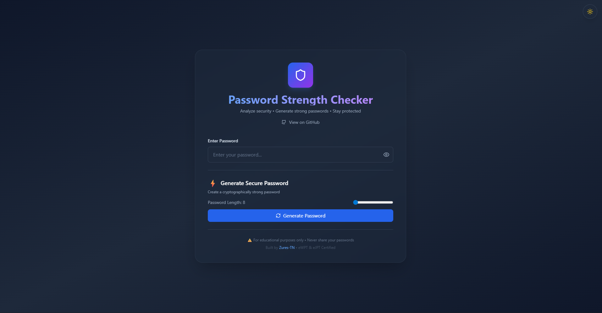

# 🔒 Password Strength Checker

A modern, real-time password strength analyzer built with React and Vite. This tool helps users understand password security through entropy calculation, pattern detection, and visual feedback.

## ✨ Features

- **Real-time Strength Analysis** - Instant feedback as you type
- **Entropy Calculation** - Shannon entropy-based security measurement
- **Crack Time Estimation** - Estimates time to crack using brute force
- **Pattern Detection** - Identifies common passwords and weak patterns
- **Password Generator** - Create cryptographically strong passwords
- **Dark/Light Theme** - Toggle between themes with persistent storage
- **Modern UI** - Sleek design with Tailwind CSS and glassmorphism effects
- **Visual Feedback** - Color-coded strength meter and animated transitions

## 🎯 Security Criteria

The tool evaluates passwords based on:

- ✅ Minimum 8 characters (recommended 12+)
- ✅ Uppercase letters (A-Z)
- ✅ Lowercase letters (a-z)
- ✅ Numbers (0-9)
- ✅ Special characters (!@#$%^&*...)
- ⚠️ Common pattern detection
- ⚠️ Repeating character detection
- ⚠️ Keyboard sequence detection

## 📸 Screenshots

### Main Interface

## 🛠️ Tech Stack

- **Frontend:** React 18.x
- **Build Tool:** Vite 5.x
- **Styling:** Tailwind CSS 3.x
- **Icons:** Lucide React
- **Language:** JavaScript (ES6+)
- **Package Manager:** npm

## 📋 Prerequisites

Before you begin, ensure you have the following installed:

- **Node.js** (v20.18.0 or higher) - [Download here](https://nodejs.org/)
- **npm** (comes with Node.js) or **yarn**
- **Git** - [Download here](https://git-scm.com/)
- A modern web browser (Chrome, Firefox, Edge, Safari)

### Check Your Environment

